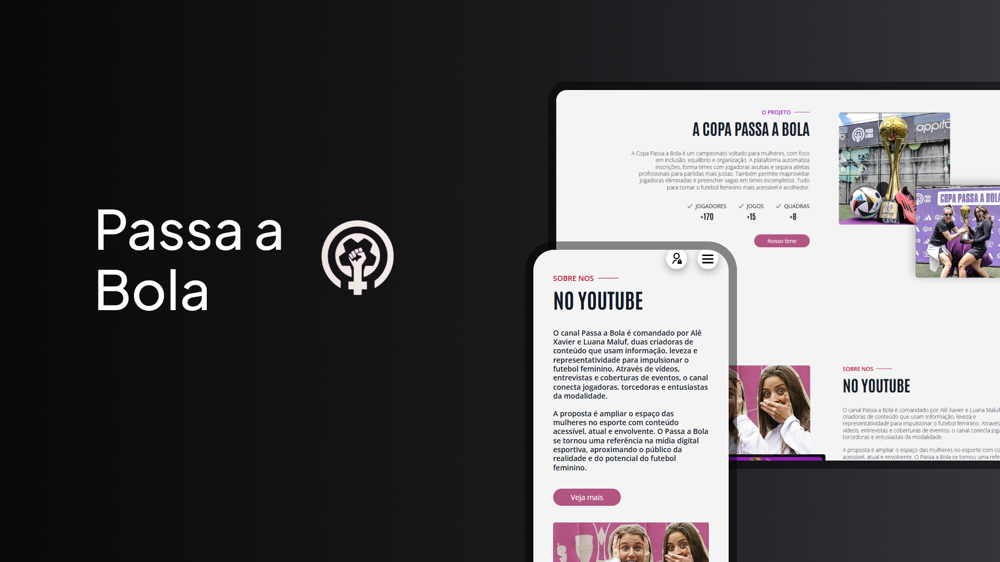

<h1 align="center">⚽ Passa a Bola</h1>

  <a href="#-tecnologias">Tecnologias</a>&nbsp;&nbsp;&nbsp;|&nbsp;&nbsp;&nbsp;
  <a href="#-projeto">Projeto</a>&nbsp;&nbsp;&nbsp;|&nbsp;&nbsp;&nbsp;
  <a href="#-funcionalidades">Funcionalidades</a>&nbsp;&nbsp;&nbsp;|&nbsp;&nbsp;&nbsp;
  <a href="#-deployment">Deployment</a>&nbsp;&nbsp;&nbsp;|&nbsp;&nbsp;&nbsp;
  <a href="#-autores">Autores</a>

 

  

---

## 🚀 Tecnologias

Este projeto foi desenvolvido com as seguintes tecnologias:

---

## 💻 Projeto

O **Passa a Bola** é uma plataforma desenvolvida para a empresa liderada por **Luana Maluf** e **Alê Xavier**, com o objetivo de **automatizar e otimizar os processos organizacionais dos campeonatos de futebol feminino**.  

Antes, toda a organização era feita manualmente (tabelas no papel, anotações dispersas e muita sobrecarga da equipe). Agora, com a aplicação, oferecemos um sistema **moderno, responsivo e centralizado** que facilita o acesso a informações para **organizadores e jogadoras**.  

---

## ✨ Funcionalidades

✔️ **Autenticação de usuários** (login com dados salvos em localStorage).  
✔️ **Interface totalmente responsiva** para diferentes tamanhos de tela.  
✔️ **Design moderno** utilizando **TailwindCSS** e **Shadcn/UI**.  
✔️ **Ícones dinâmicos** com **React Icons**.  
✔️ **Integração com API** para simulação de dados (`json.placeholder`).  

> Login de teste:  
> 📧 **luanaMaluf@gmail.com**  
> 🔑 **admin**

---

## 📦 Bibliotecas e ferramentas extras

- [Shadcn/UI](https://ui.shadcn.com/) → componentes prontos e acessíveis.  
- [Ant Design](https://ant.design/) → elementos visuais para a interface.  
- [React Icons](https://react-icons.github.io/react-icons/) → ícones personalizáveis.  

---

## 🌍 Deployment

Você pode acessar o projeto através da Vercel neste link:  

👉 [**Passa a Bola - Acesse aqui**](https://passa-a-bola-one.vercel.app/)

---

## 👨‍💻 Autores

- [Augusto Valerio](https://github.com/Augusto-Valerio)  
- [Jonas Esteves](https://github.com/JonasEstevess)  
- [Josué Faria](https://github.com/Josufaria)  
- [Mariana Silva](https://github.com/Marirsil)  
- [Vitor Tigre](https://github.com/VitorTigre)  
